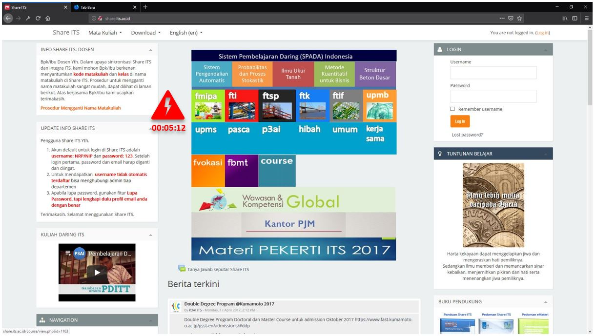
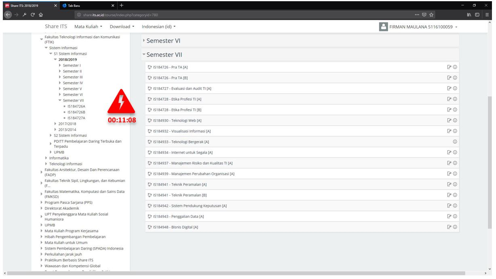

# Assignment - 1
- Firman Maulana
- 05111640000059
- Human - Computer Interaction A

# Contextual Inquiry and Analysis
## Website Description


Share.its.ac.id is one of the e-learning website that ITS provide to their students. Teachers can create courses that students can enroll in this site. This website is also open for public use that other people can use. Despite of being used by public, this website has some problem in it. One of the problem is in their navigation system which is inconsistent.


As you notice from sidebar (right) there are only 3 courses available while in the course menu (left) you can clearly see that there is atleast 6 courses available. I noticed that when you use sidebar for navigation it will **have different URL** from using course menu for navigation. However, after further testing the website, it's still possible to accomplish the task just using the sidebar.

## Instruction Script
*Please refer to [script.md](document/script.md) about what i **should** ask and refer to [Transcript](#transcript) for what i **actualy** ask during the interview with the user*
User **(if possible)** must do all of the following instruction sequentially.
1. Starting from Share ITS's homepage and given the required username and password, user must log in to the website.
2. Starting from Share ITS's homepage and given the course code and name, user must navigate to a courses named "Teknologi Bergerak" using any method. User should open the course's page but don't need to enroll in it.
3. Starting from Share ITS's homepage and given the course code and name, user must navigate to a courses named "Teknologi Bergerak" using **only** sidebar and breadcrumbs. User should open the course's page but don't need to enroll in it.
4. User must know what courses that i currently attend. User only need to open the required page.
5. User must log out from the website. 
## User Description
Below is the description of the user that **may or may not** have direct impact with the interview:
- Female 
- 25 Years Old
- Bachelor of Public Health from Unair University
- Already used E-Learning website before
- Active internet user
- Active computer and smartphone (Android) user
## Transcript
Please kept in mind that most of the interaction here is informal. Some of the conversations are **not written** in the transcript as it doesn't contains any useful information.
```
- BEGIN USER INFORMATION GATHERING -
00:00:07 - Me : (Some informal introduction)
00:00:30 - Me : Apakah anda termasuk pengguna aktif internet?
00:00:34 - Her : Ya, tentu saja, saya menggunakan internet setiap hari.
00:00:36 - Me : Seberapa sering anda menggunakan internet?
00:00:38 - Her : Di setiap jeda waktu saya menggunakan internet terutama di sosial media.
00:00:44 - Me : Website seperti apa yang anda gunakan setiap hari?
00:00:54 - Her : Saya tidak langsung menggunakannya, tetapi menggunakan aplikasinya, seperti instagram whatsapp, twitter, facebook seperti itu. Kadang saya juga menggunakan youtube dan google seperti itu.
00:01:34 - Me : Seberapa lama anda harus belajar kembali ketika adanya perubahan navigasi?
00:01:36 - Her : Tidak lama, karena generasi milenial sekali klik ada contohnya next - next ya ikutin aja seperti itu.
00:03:03 - Me : Pernah gk menggunakan website seperti e-learning atau online learning?
00:03:16 - Her : E-Learning pernah membuka tapi jarang memanfaatkan, biasanya sih untuk mengerjakan skripsi menggunakan internet Unair. Kadang hanya bisa menggunakan internet kampus.
- BEGIN INSTRUCTION SCRIPT -
00:04:41 - Me : (Explain about what the user must achieve and the goal of this interview)
00:04:58 - Me : (Open Share.its.ac.id) Menurut anda tampilan awal dari gimana?
00:05:12 - Her : Cukup menarik, (Move mouse to left side navigation and hoving around "UPDATE INFO SHARE ITS") Ini terlalu panjang tulisannya. 
00:05:26 - Her : (Move mouse to center and hover around Centered Menu) Mungkin akan lebih memudahkan kalau menggunakan gambar - gambar seperti ini.
00:05:40 - Me : (Explains about the instructions)
00:05:43 - Me : (Explains about the first instruction) Pertama silahkan lakukan login, untuk usernamenya *(Username)* dan *(Password)*
00:06:01 - Her : (Directly move mouse to right side menu and click the Username field and password and start typing in it)
00:06:21 - Her : (Website Loading) lamanya.
00:06:28 - Me : (Explains about the second instruction) Tolong cari sebuah kelas bernama "Teknologi Bergerak" kelasnya itu di FTIF, fakultas teknologi informasi dan dijurusan sistem informasi.
00:06:34 - Her : (Moves the cursor to center menu and clicks "FTIF" text)
00:06:41 - Her : (Moves the cursor to center menu and clicks "Sistem Informasi" text)
00:06:43 - Her : (Moves the cursor to center menu and clicks "S1/Sistem Informasi" text)
00:06:47 - Her : (Moves the cursor to center menu and clicks "S1/Sistem Informasi" text)
00:06:52 - Her : (Moves the cursor to dropdown and clicks "2018/2019")
00:07:02 - Her : (Open one of the semester tab)
00:07:16 - Her : (Landed at "Organisasi dan fungsional bisnis")
00:07:23 - Her : (Noticed the search field and begin writing the "Teknologi Bergerak")
00:07:35 - Her : (Shown 3 different courses and clicked the "Sistem Komunikasi Nirkabel dan Bergerak")
00:08:03 - Her : (Clicked the back button multiple times until it ends up in the FTIF page)
00:08:10 - Her : (Used the search again)
00:08:31 - Her : (Finally found the required courses)
00:08:33 - Me : (Explains 2nd instruction) Hanya menggunakan navigasi di kiri dan diatas saja, anda diminta mencari kelas bernama "Teknologi Bergerak".
00:09:52 - Her : (Clicked the top navigation bar on "Mata Kuliah" and find the "Sistem Informasi")
00:10:30 - Her : (Clicked "Matematika diskrit")
00:11:08 - Her : (Clicked the left navigation one by one)
00:11:31 - Her : (Clicked "Matematika diskrit" again)
00:11:45 - Her : (Clicked the left navigation one by one)
00:12:03 - Her : (Clicked "Manajemen Pengadaan dan Investasi TI A")
00:12:35 - Her : (Clicked the left navigation one by one)
00:13:18 - Her : (Clicked "Manajemen Kualitas TI")
00:13:21 - Her : (Used top navigation)
00:14:11 - Her : (Clicked the left navigation one by one)
00:14:17 - Her : (Noticed that it didn't exist in the left side navigation)
00:14:20 - Her : (Opened all courses on "Semester VII" one by one)
00:15:16 - Her : (Explain to me that it wasn't possible)
00:15:20 - Me : (Explains the 3rd instruction) Tolong tunjukkan kursus yang sedang atau sudah saya ambil.
00:15:22 - Her : (Clicked the "Firman Maulana 05111640000059")
00:15:28 - Her : (Clicked the "Dashboard" and finally found it)
00:15:36 - Me : (Explain 4th instruction) Silahkan menlogout dari sistem ini.
00:15:37 - Her : (Clicked the "Firman Maulana 05111640000059")
00:15:39 - Her : (Clicked the "Logout")
```
## Models and Annotations
### Artifact Model
The artifact model is mainly a collection of artifacts. [UXBook:237]


This is how the homepage looks like. The left sidebar has too much text in one area. Or atleast don't put it in the homepage as not everyone is a Teacher. User usually do login using a form in the top right corner. 


User can access this page by using "Dashboard" menu in the user drop down field. The side navigation didn't show the list of possible class that usualy be found in other page.


This is the result of searching teknologi bergerak in the search form. As you can see that "Teknologi Bergerak" doesn't have any description which make it looks like it isn't one of the search result. My subject needs to perform the search atleast 2 times before she realize that it was one of the search result.


This is how the page looks like inside "Sistem Informasi"'s "Semeter VII". As you can see that the side navigation and the main navigation has different contents forcing user to use the main navigation.


Here is how the "Sistem Informasi" page looks like. Users seems to ignore that there is a breadcrumb in this page that can be used for quick naviation and prefer to click backward instead of using it.

### Flow Model
A flow model is a diagram giving the big picture or overview of work, emphasizing communication and information flow among work roles and between work roles and system components within the work practice of an organization. [UXBook:190]


### Cultural Model

## Do's and Don't's
Fusce lobortis massa mauris, in aliquam erat aliquet eget. Donec rhoncus venenatis mauris, at commodo odio bibendum ac. Sed consectetur enim justo, vitae maximus eros elementum non. Sed feugiat orci sem, vel faucibus sem aliquet sed. Praesent pulvinar felis eget nisl varius, id lacinia urna pretium. Sed at ornare diam, nec fringilla dolor. In ut gravida sapien, eget varius magna. Morbi lobortis ex eu eleifend finibus. Phasellus eget nulla ullamcorper, ullamcorper purus ac, luctus turpis. Sed volutpat mauris ut erat consectetur, in sagittis erat egestas.

# References
Hartson Rex. Pyla Pardha. 2012. Elsefeir. The UX Book Process and Guidelines for Ensuring a Quality User Experience [UXBook]
